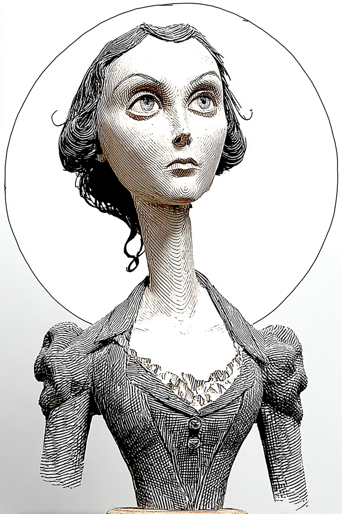

# Calculus — Wayback Sections

> Extracted from `chapters/`. Each entry corresponds to one chapter file.
> Sections are instructor-authored. Missing sections show a placeholder only.
> Do not edit this file directly — edit the source chapter file, then re-run extraction.

---

## Chapter 00: Calculus: with LLMs
*Source: `chapters/00-frontmatter.md`*

> **Section not yet authored.** No `## AI Wayback Machine` block found in this chapter file.
> To add this section, edit the source chapter file directly.

---

## Chapter 00: Introduction
*Source: `chapters/00-introduction.md`*

> **Section not yet authored.** No `## AI Wayback Machine` block found in this chapter file.
> To add this section, edit the source chapter file directly.

---

## Chapter 01: Chapter 1 — Functions and Graphs
*Source: `chapters/01-functions-and-graphs.md`*

##  AI Wayback Machine
The ideas in this chapter didn't appear from nowhere. **Sophie Germain** taught herself calculus during the French Revolution by reading Lagrange and Euler — sometimes corresponding with Gauss under the male pseudonym M. Le Blanc. Her work on Fermat's Last Theorem and on elasticity theory earned her a Paris Academy prize that she could not receive in person because she was a woman.



*Puppet Art by [Nik Bear Brown](https://www.nikbearbrown.com/).*

**Run this:**

```
Who was Sophie Germain, and how does her mathematical work connect to the functions and graphs we covered in this chapter? Keep it to three paragraphs. End with the single most surprising thing about her career or ideas.
```

→ Search **"Sophie Germain"** on Wikipedia.

**Now make the prompt better.** Try one of these:

- Ask it to walk through one of Germain's results on elasticity — using the language of functions and graphs you just learned.
- Ask it about Gauss's letter to Germain after he discovered she was a woman.

What changes? What gets better? What gets worse?

---

## Chapter 02: Chapter 2 — Limits
*Source: `chapters/02-limits.md`*

##  AI Wayback Machine
The ideas in this chapter didn't appear from nowhere. **Augustin-Louis Cauchy** wrote *Cours d'Analyse* in 1821 — the textbook that put limits on rigorous footing for the first time, replacing Newton's and Leibniz's infinitesimals with an epsilon-delta framework. Modern calculus rigor begins with him.

**Run this:**

```
Who was Augustin-Louis Cauchy, and how does his rigorous treatment of limits connect to the limit concepts we covered in this chapter? Keep it to three paragraphs. End with the single most surprising thing about his career or ideas.
```

→ Search **"Augustin-Louis Cauchy"** on Wikipedia.

**Now make the prompt better.** Try one of these:

- Ask it to walk through one Cauchy epsilon-delta argument step by step on a specific limit.
- Ask it about Cauchy's prolific output — over 800 papers — and the political exile that pushed him to Turin and Prague.

What changes? What gets better? What gets worse?

---

## Chapter 03: Chapter 3 — Derivatives
*Source: `chapters/03-derivatives.md`*

##  AI Wayback Machine
The ideas in this chapter didn't appear from nowhere. **Maria Gaetana Agnesi** wrote *Instituzioni analitiche* in 1748 — the first textbook to cover both differential and integral calculus in a unified system. The curve called the "witch of Agnesi" is a mistranslation; the Italian was "averse" or "turning," not "witch."

**Run this:**

```
Who was Maria Gaetana Agnesi, and how does her unified treatment of calculus connect to the derivatives we covered in this chapter? Keep it to three paragraphs. End with the single most surprising thing about her career or ideas.
```

→ Search **"Maria Gaetana Agnesi"** on Wikipedia.

**Now make the prompt better.** Try one of these:

- Ask it to derive the curve known as the "witch of Agnesi" and explain how Agnesi originally presented it.
- Ask it about Agnesi's later abandonment of mathematics for the religious care of the poor — and what that suggests about 18th-century intellectual life.

What changes? What gets better? What gets worse?

---

## Chapter 04: Chapter 4 — Applications of Derivatives
*Source: `chapters/04-applications-of-derivatives.md`*

##  AI Wayback Machine
The ideas in this chapter didn't appear from nowhere. **Pierre de Fermat** developed methods for finding tangent lines and optimization extrema in the 1630s — predating Newton and Leibniz by a generation. His "method of adequality" is, in modern eyes, the derivative test with a different vocabulary.

**Run this:**

```
Who was Pierre de Fermat, and how does his method of adequality connect to the optimization applications of derivatives we covered in this chapter? Keep it to three paragraphs. End with the single most surprising thing about his career or ideas.
```

→ Search **"Pierre de Fermat"** on Wikipedia.

**Now make the prompt better.** Try one of these:

- Ask it to find a maximum using Fermat's method on one specific function — and translate the steps into modern derivative notation.
- Ask it about Fermat's day job as a magistrate, and how mathematics fit into a working lawyer's life.

What changes? What gets better? What gets worse?

---

## Chapter 05: Chapter 5 — Integration
*Source: `chapters/05-integration.md`*

##  AI Wayback Machine
The ideas in this chapter didn't appear from nowhere. **Bernhard Riemann** introduced the rigorous definition of the integral that bears his name in 1854 — partitioning intervals into smaller and smaller pieces and taking the limit of the sums. The Riemann sum you computed in this chapter is the foundation of every modern integration technique.

**Run this:**

```
Who was Bernhard Riemann, and how does the Riemann integral connect to the integration concepts we covered in this chapter? Keep it to three paragraphs. End with the single most surprising thing about his career or ideas.
```

→ Search **"Bernhard Riemann"** on Wikipedia.

**Now make the prompt better.** Try one of these:

- Ask it to compute a Riemann sum on one specific function by hand and compare it with the exact integral.
- Ask it about Riemann's other contributions — Riemann surfaces, the Riemann zeta function, Riemannian geometry — and which one led to general relativity.

What changes? What gets better? What gets worse?

---

## Chapter 06: Chapter 6 — Applications of Integration
*Source: `chapters/06-applications-of-integration.md`*

##  AI Wayback Machine
The ideas in this chapter didn't appear from nowhere. **Émilie du Châtelet** translated Newton's *Principia* into French in the 1740s — adding her own commentary on the calculus of motion and area that introduced the concept of *kinetic energy* (mv²) into Continental physics. The work she did made Newton applicable to real engineering problems.


*Puppet Art by [Nik Bear Brown](https://www.nikbearbrown.com/).*

**Run this:**

```
Who was Émilie du Châtelet, and how does her work translating and commenting on Newton's Principia connect to the applications of integration we covered in this chapter? Keep it to three paragraphs. End with the single most surprising thing about her career or ideas.
```

→ Search **"Émilie du Châtelet"** on Wikipedia.

**Now make the prompt better.** Try one of these:

- Ask it to walk through one of du Châtelet's energy-from-motion arguments using the integration techniques you just learned.
- Add a constraint: "Answer as du Châtelet's introductory note to her 1746 translation of Newton."

What changes? What gets better? What gets worse?

---

## Chapter 99: 99 Back Matter
*Source: `chapters/99-back-matter.md`*

> **Section not yet authored.** No `## AI Wayback Machine` block found in this chapter file.
> To add this section, edit the source chapter file directly.

---
